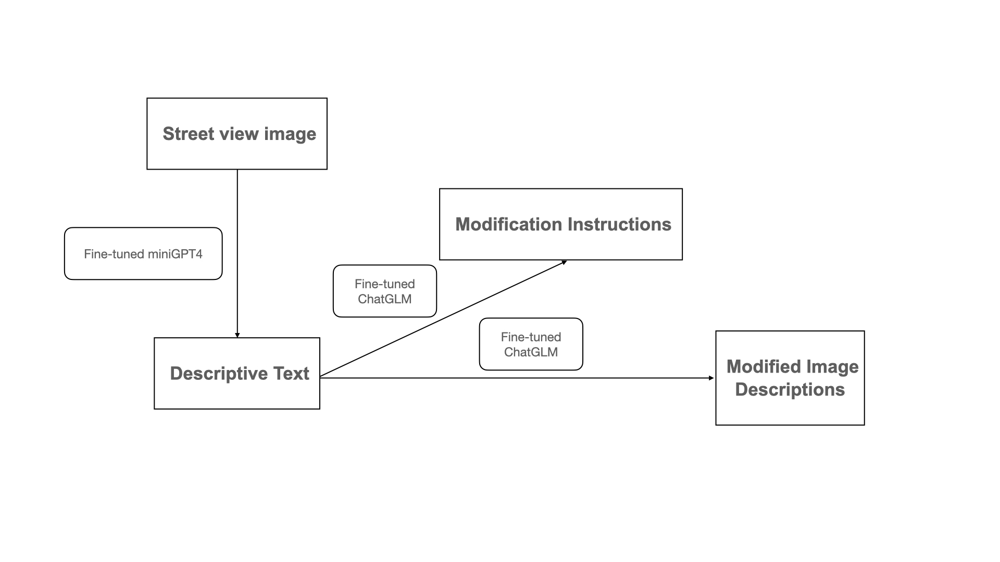

# Street View Image Descriptive Dataset

## Overview
This repository provides a dataset designed for street view imagery modification, consisting of 15,000 street view images along with their detailed descriptions and corresponding modification instructions. The dataset is divided into **three** main parts:

- Descriptive Text [`original_cap.json`](./original_cap.json):
  
This part contains **15,000** textual descriptions of the original street view images. Each description offers a detailed account of the visual elements present in the scene, such as buildings, trees, vehicles, and environmental features. 

* Modification Instructions [`instruction.json`](./instruction.json):
  
For each street view image, there is a corresponding set of modification instructions. These instructions outline specific changes or alterations that need to be applied to the original image. The modification includes three common operations for street-view image editing: **add**, **remove**, and **change objects or scenes**.

+ Modified Image Descriptions [`new_cap.json`](./new_cap.json):
  
After the modifications are applied, a new set of descriptive texts is generated to reflect the altered street view images. This section also contains 15,000 new descriptions that capture the changes made to each street view image, providing a comprehensive narrative of the modifications.

## Dataset Creation Process

## Results of Fine-Tuning [instruct-pix2pix] (https://github.com/timothybrooks/instruct-pix2pix) with Our Dataset

